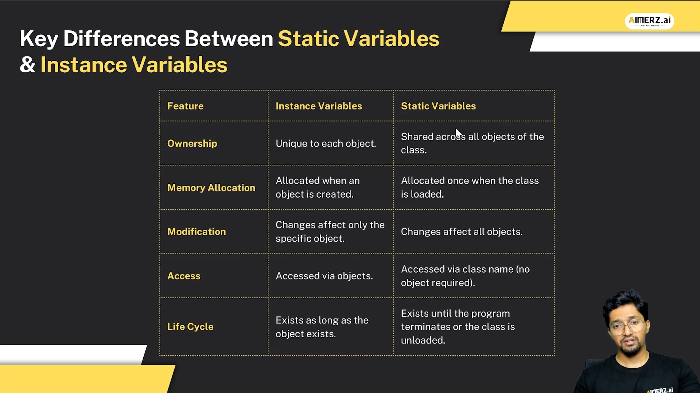

# Java Notes

## Fundamentals of Java

- [Getting Started with Java (Fundamentals and Setup) Notes](../assets/docs/Getting%20Started%20with%20Java%20(Fundamentals%20and%20Setup)%20Notes.pdf)
- [Fundamentals of Java Programming -2 (Syntax, Control Structures, and Operators) Notes](../assets/docs/Fundamentals%20of%20Java%20Programming%20-2%20(Syntax,%20Control%20Structures,%20and%20Operators)%20Notes.pdf)
- [Fundamentals of Java Programming -3 (Methods in Java & Control flow of Methodls-(Main Method)) Notes](../assets/docs/Fundamentals%20of%20Java%20Programming%20-3%20(Methods%20in%20Java%20&%20Control%20flow%20of%20Methodls-(Main%20Method))%20Notes.pdf)
- [Fundamentals of Java Programming -4 (Methods Overloading & Compile-time Polymorphism)](../assets/docs/Fundamentals%20of%20Java%20Programming%20-4%20(Methods%20Overloading%20&%20Compile-time%20Polymorphism).pdf)
- [Fundamentals of Java - 5 Notes](../assets/docs/Fundamentals%20of%20Java%20-%205%20Notes.pdf)
- [Fundamentals of Java - 6 Introduction to Object Oriented Principels Creating Class and Objects Notes](../assets/docs/Fundamentals%20of%20Java%20-%206%20Introduction%20to%20Object%20Oriented%20Principels%20Creating%20Class%20and%20Objects%20Notes.pdf)

## Java Object-Oriented Programming (OOP)

- 
- [JVM Memory Areas Notes](../assets/docs/JVM%20MemoryAreas%20Notes.pdf)
- [Instance Variables and Local, Variables Static Vs Instance Members Notes](../assets/docs/Instance%20Variables%20and%20Local,%20Variables%20Static%20Vs%20Instance%20Members%20(Notes)%20.pdf)
- [Constructors, this() method Static Block Non-Static Block & Order of Execution Notes](../assets/docs/Constructors,%20this()%20method%20Static%20Block%20Non-Static%20Block%20&%20Order%20of%20Execution%20Notes.pdf)
- [Arrays (1D,2D,3D) and Encapsulation and This keyword Notes](../assets/docs/Arrays%20(1D,2D,3D)%20and%20Encapsulation%20and%20This%20keyword%20Notes.pdf)
- [Packages, Access, Final, Overriding, Polymorphism Notes](../assets/docs/Packages,%20Access,%20Final,%20Overriding,%20Polymorphism%20Notes.pdf)
- [Abstraction & Interface Notes](../assets/docs/Abstraction%20&%20Interface%20Notes.pdf)
- [Implementing Interface and abstraction Notes](../assets/docs/Implementing%20Interface%20and%20abstraction%20Notes.pdf)
- [Working with String Object Notes](../assets//docs/Working%20with%20String%20Object%20Notes.pdf)
- [Handling Exceptions in Java - I Notes](../assets/docs/Handling%20Exceptions%20in%20Java%20-%20I%20Notes.pdf)
- [Handling Exceptions in Java - II Notes](../assets/docs/Handling%20Exceptions%20in%20Java%20-%20II%20Notes.pdf)
- [Handling Exceptions in Java - III Notes](../assets/docs/Handling%20Exceptions%20in%20Java%20-%20III%20Notes.pdf)

## Multithreading in Java

- [Introduction to Concurrency and Threading Notes](../assets/docs/Introduction%20to%20Concurrency%20and%20Threading%20Notes.pdf)
- [Thread Management- Runnable Interface and Control Methods Notes](../assets/docs/Thread%20Management-%20Runnable%20Interface%20and%20Control%20Methods%20Notes.pdf)
- [Thread Addressing and Synchronization Techniques Notes](../assets/docs/Thread%20Addressing%20and%20Synchronization%20Techniques%20Notes.pdf)
- [Advanced Locking and Synchronization in Concurrency Notes](../assets/docs/Advanced%20Locking%20and%20Synchronization%20in%20Concurrency%20Notes.pdf)
- [Concurrency in Java- Thread Pools, Executors, Callable & Future Notes](../assets/docs/Concurrency%20in%20Java-%20Thread%20Pools,%20Executors,%20Callable%20&%20Future%20Notes.pdf)
- [Deadlock Scenarios & Daemon Threads Notes](../assets/docs/Deadlock%20Scenarios%20&%20Daemon%20Threads%20Notes.pdf)

## Wrapper Classes & Generics

- [Wrapper Classes & Generics Notes](../assets/docs/Wrapper%20Classes%20&%20Generics%20Notes.pdf)

## Collections Framework/API

- [Collection Framework- Overview, interfaces, hierarchy, List, Set, and key classes Notes](../assets/docs/Collection%20Framework-%20Overview,%20interfaces,%20hierarchy,%20List,%20Set,%20and%20key%20classes%20Notes.pdf)
- [Queue, iterators, and concurrent modification- Fail-Fast vs. Fail-Safe Notes](../assets/docs/Queue,%20iterators,%20and%20concurrent%20modification-%20Fail-Fast%20vs.%20Fail-Safe%20Notes.pdf)
- [MAP & Properties Class Notes](../assets/docs/MAP%20&%20Properties%20Class%20Notes.pdf)
- [Working with Utility Class (Arrays & Collections) Notes](../assets/docs/Working%20with%20Utility%20Class%20(Arrays%20&%20Collections)%20Notes.pdf)
- [Serialization, Cloning, and Garbage Collection in Java Notes](../assets/docs/Serialization,%20Cloning,%20and%20Garbage%20Collection%20in%20Java%20Notes.pdf)

## ENums

- [ENUM Overview, Advantages, Definition Notes](../assets/docs/ENUM%20Overview,%20Advantages,%20Definition%20Notes.pdf)
